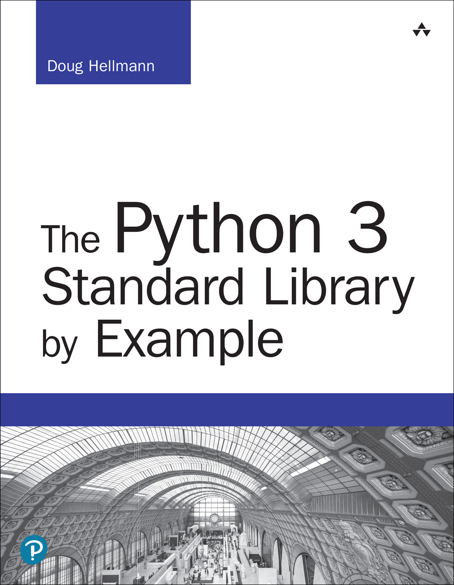

+++
title = "Standard Library"
description = ""
weight = 1
+++
**The Python Standard Library By Example**

PyMOTW-3 is a series of articles written by [Doug Hellmann](http://doughellmann.com/) to demonstrate how to use the modules of the [Python](http://www.python.org/) 3 standard library. It is based on the original [PyMOTW](http://pymotw.com/2/) series, which covered Python 2.7. See [About Python Module of the Week](https://pymotw.com/3/about.html) for details including the version of Python and tools used.
<!--more-->
-   [Text](https://pymotw.com/3/text.html)
    -   [string — Text Constants and Templates](https://pymotw.com/3/string/index.html)
    -   [textwrap — Formatting Text Paragraphs](https://pymotw.com/3/textwrap/index.html)
    -   [re — Regular Expressions](https://pymotw.com/3/re/index.html)
    -   [difflib — Compare Sequences](https://pymotw.com/3/difflib/index.html)
-   [Data Structures](https://pymotw.com/3/data_structures.html)
    -   [enum – Enumeration Type](https://pymotw.com/3/enum/index.html)
    -   [collections — Container Data Types](https://pymotw.com/3/collections/index.html)
    -   [array — Sequence of Fixed-type Data](https://pymotw.com/3/array/index.html)
    -   [heapq – Heap Sort Algorithm](https://pymotw.com/3/heapq/index.html)
    -   [bisect — Maintain Lists in Sorted Order](https://pymotw.com/3/bisect/index.html)
    -   [queue — Thread-Safe FIFO Implementation](https://pymotw.com/3/queue/index.html)
    -   [struct — Binary Data Structures](https://pymotw.com/3/struct/index.html)
    -   [weakref — Impermanent References to Objects](https://pymotw.com/3/weakref/index.html)
    -   [copy — Duplicate Objects](https://pymotw.com/3/copy/index.html)
    -   [pprint — Pretty-Print Data Structures](https://pymotw.com/3/pprint/index.html)
-   [Algorithms](https://pymotw.com/3/algorithm_tools.html)
    -   [functools — Tools for Manipulating Functions](https://pymotw.com/3/functools/index.html)
    -   [itertools — Iterator Functions](https://pymotw.com/3/itertools/index.html)
    -   [operator — Functional Interface to Built-in Operators](https://pymotw.com/3/operator/index.html)
    -   [contextlib — Context Manager Utilities](https://pymotw.com/3/contextlib/index.html)
-   [Dates and Times](https://pymotw.com/3/dates.html)
    -   [time — Clock Time](https://pymotw.com/3/time/index.html)
    -   [datetime — Date and Time Value Manipulation](https://pymotw.com/3/datetime/index.html)
    -   [calendar — Work with Dates](https://pymotw.com/3/calendar/index.html)
-   [Mathematics](https://pymotw.com/3/numeric.html)
    -   [decimal — Fixed and Floating Point Math](https://pymotw.com/3/decimal/index.html)
    -   [fractions — Rational Numbers](https://pymotw.com/3/fractions/index.html)
    -   [random — Pseudorandom Number Generators](https://pymotw.com/3/random/index.html)
    -   [math — Mathematical Functions](https://pymotw.com/3/math/index.html)
    -   [statistics — Statistical Calculations](https://pymotw.com/3/statistics/index.html)
-   [The File System](https://pymotw.com/3/file_access.html)
    -   [os.path — Platform-independent Manipulation of Filenames](https://pymotw.com/3/os.path/index.html)
    -   [pathlib — Filesystem Paths as Objects](https://pymotw.com/3/pathlib/index.html)
    -   [glob — Filename Pattern Matching](https://pymotw.com/3/glob/index.html)
    -   [fnmatch — Unix-style Glob Pattern Matching](https://pymotw.com/3/fnmatch/index.html)
    -   [linecache — Read Text Files Efficiently](https://pymotw.com/3/linecache/index.html)
    -   [tempfile — Temporary File System Objects](https://pymotw.com/3/tempfile/index.html)
    -   [shutil — High-level File Operations](https://pymotw.com/3/shutil/index.html)
    -   [filecmp — Compare Files](https://pymotw.com/3/filecmp/index.html)
    -   [mmap — Memory-map Files](https://pymotw.com/3/mmap/index.html)
    -   [codecs — String Encoding and Decoding](https://pymotw.com/3/codecs/index.html)
    -   [io — Text, Binary, and Raw Stream I/O Tools](https://pymotw.com/3/io/index.html)
-   [Data Persistence and Exchange](https://pymotw.com/3/persistence.html)
    -   [pickle — Object Serialization](https://pymotw.com/3/pickle/index.html)
    -   [shelve — Persistent Storage of Objects](https://pymotw.com/3/shelve/index.html)
    -   [dbm — Unix Key-Value Databases](https://pymotw.com/3/dbm/index.html)
    -   [sqlite3 — Embedded Relational Database](https://pymotw.com/3/sqlite3/index.html)
    -   [xml.etree.ElementTree — XML Manipulation API](https://pymotw.com/3/xml.etree.ElementTree/index.html)
    -   [csv — Comma-separated Value Files](https://pymotw.com/3/csv/index.html)
-   [Data Compression and Archiving](https://pymotw.com/3/compression.html)
    -   [zlib — GNU zlib Compression](https://pymotw.com/3/zlib/index.html)
    -   [gzip — Read and Write GNU zip Files](https://pymotw.com/3/gzip/index.html)
    -   [bz2 — bzip2 Compression](https://pymotw.com/3/bz2/index.html)
    -   [tarfile — Tar Archive Access](https://pymotw.com/3/tarfile/index.html)
    -   [zipfile — ZIP Archive Access](https://pymotw.com/3/zipfile/index.html)
-   [Cryptography](https://pymotw.com/3/cryptographic.html)
    -   [hashlib — Cryptographic Hashing](https://pymotw.com/3/hashlib/index.html)
    -   [hmac — Cryptographic Message Signing and Verification](https://pymotw.com/3/hmac/index.html)
-   [Concurrency with Processes, Threads, and Coroutines](https://pymotw.com/3/concurrency.html)
    -   [subprocess — Spawning Additional Processes](https://pymotw.com/3/subprocess/index.html)
    -   [signal — Asynchronous System Events](https://pymotw.com/3/signal/index.html)
    -   [threading — Manage Concurrent Operations Within a Process](https://pymotw.com/3/threading/index.html)
    -   [multiprocessing — Manage Processes Like Threads](https://pymotw.com/3/multiprocessing/index.html)
    -   [asyncio — Asynchronous I/O, event loop, and concurrency tools](https://pymotw.com/3/asyncio/index.html)
    -   [concurrent.futures — Manage Pools of Concurrent Tasks](https://pymotw.com/3/concurrent.futures/index.html)
-   [Networking](https://pymotw.com/3/networking.html)
    -   [ipaddress — Internet Addresses](https://pymotw.com/3/ipaddress/index.html)
    -   [socket — Network Communication](https://pymotw.com/3/socket/index.html)
    -   [selectors — I/O Multiplexing Abstractions](https://pymotw.com/3/selectors/index.html)
    -   [select — Wait for I/O Efficiently](https://pymotw.com/3/select/index.html)
    -   [socketserver — Creating Network Servers](https://pymotw.com/3/socketserver/index.html)
-   [The Internet](https://pymotw.com/3/internet_protocols.html)
    -   [urllib.parse — Split URLs into Components](https://pymotw.com/3/urllib.parse/index.html)
    -   [urllib.request — Network Resource Access](https://pymotw.com/3/urllib.request/index.html)
    -   [urllib.robotparser — Internet Spider Access Control](https://pymotw.com/3/urllib.robotparser/index.html)
    -   [base64 — Encode Binary Data with ASCII](https://pymotw.com/3/base64/index.html)
    -   [http.server — Base Classes for Implementing Web Servers](https://pymotw.com/3/http.server/index.html)
    -   [http.cookies — HTTP Cookies](https://pymotw.com/3/http.cookies/index.html)
    -   [webbrowser — Displays web pages](https://pymotw.com/3/webbrowser/index.html)
    -   [uuid — Universally Unique Identifiers](https://pymotw.com/3/uuid/index.html)
    -   [json — JavaScript Object Notation](https://pymotw.com/3/json/index.html)
    -   [xmlrpc.client — Client Library for XML-RPC](https://pymotw.com/3/xmlrpc.client/index.html)
    -   [xmlrpc.server — An XML-RPC server](https://pymotw.com/3/xmlrpc.server/index.html)
-   [Email](https://pymotw.com/3/email.html)
    -   [smtplib — Simple Mail Transfer Protocol Client](https://pymotw.com/3/smtplib/index.html)
    -   [smtpd — Sample Mail Servers](https://pymotw.com/3/smtpd/index.html)
    -   [mailbox — Manipulate Email Archives](https://pymotw.com/3/mailbox/index.html)
    -   [imaplib — IMAP4 Client Library](https://pymotw.com/3/imaplib/index.html)
-   [Application Building Blocks](https://pymotw.com/3/frameworks.html)
    -   [argparse — Command-Line Option and Argument Parsing](https://pymotw.com/3/argparse/index.html)
    -   [getopt — Command Line Option Parsing](https://pymotw.com/3/getopt/index.html)
    -   [readline — The GNU readline Library](https://pymotw.com/3/readline/index.html)
    -   [getpass — Secure Password Prompt](https://pymotw.com/3/getpass/index.html)
    -   [cmd — Line-oriented Command Processors](https://pymotw.com/3/cmd/index.html)
    -   [shlex — Parse Shell-style Syntaxes](https://pymotw.com/3/shlex/index.html)
    -   [configparser — Work with Configuration Files](https://pymotw.com/3/configparser/index.html)
    -   [logging — Report Status, Error, and Informational Messages](https://pymotw.com/3/logging/index.html)
    -   [fileinput — Command-Line Filter Framework](https://pymotw.com/3/fileinput/index.html)
    -   [atexit — Program Shutdown Callbacks](https://pymotw.com/3/atexit/index.html)
    -   [sched — Timed Event Scheduler](https://pymotw.com/3/sched/index.html)
-   [Internationalization and Localization](https://pymotw.com/3/i18n.html)
    -   [gettext — Message Catalogs](https://pymotw.com/3/gettext/index.html)
    -   [locale — Cultural Localization API](https://pymotw.com/3/locale/index.html)
-   [Developer Tools](https://pymotw.com/3/dev_tools.html)
    -   [pydoc — Online Help for Modules](https://pymotw.com/3/pydoc/index.html)
    -   [doctest — Testing Through Documentation](https://pymotw.com/3/doctest/index.html)
    -   [unittest — Automated Testing Framework](https://pymotw.com/3/unittest/index.html)
    -   [trace — Follow Program Flow](https://pymotw.com/3/trace/index.html)
    -   [traceback — Exceptions and Stack Traces](https://pymotw.com/3/traceback/index.html)
    -   [cgitb — Detailed Traceback Reports](https://pymotw.com/3/cgitb/index.html)
    -   [pdb — Interactive Debugger](https://pymotw.com/3/pdb/index.html)
    -   [profile and pstats — Performance Analysis](https://pymotw.com/3/profile/index.html)
    -   [timeit — Time the execution of small bits of Python code.](https://pymotw.com/3/timeit/index.html)
    -   [tabnanny — Indentation validator](https://pymotw.com/3/tabnanny/index.html)
    -   [compileall — Byte-compile Source Files](https://pymotw.com/3/compileall/index.html)
    -   [pyclbr — Class Browser](https://pymotw.com/3/pyclbr/index.html)
    -   [venv — Create Virtual Environments](https://pymotw.com/3/venv/index.html)
    -   [ensurepip — Install the Python Package Installer](https://pymotw.com/3/ensurepip/index.html)
-   [Runtime Features](https://pymotw.com/3/runtime_services.html)
    -   [site — Site-wide Configuration](https://pymotw.com/3/site/index.html)
    -   [sys — System-specific Configuration](https://pymotw.com/3/sys/index.html)
    -   [os — Portable access to operating system specific features](https://pymotw.com/3/os/index.html)
    -   [platform — System Version Information](https://pymotw.com/3/platform/index.html)
    -   [resource — System Resource Management](https://pymotw.com/3/resource/index.html)
    -   [gc — Garbage Collector](https://pymotw.com/3/gc/index.html)
    -   [sysconfig — Interpreter Compile-time Configuration](https://pymotw.com/3/sysconfig/index.html)
-   [Language Tools](https://pymotw.com/3/language.html)
    -   [warnings — Non-fatal Alerts](https://pymotw.com/3/warnings/index.html)
    -   [abc — Abstract Base Classes](https://pymotw.com/3/abc/index.html)
    -   [dis — Python Bytecode Disassembler](https://pymotw.com/3/dis/index.html)
    -   [inspect — Inspect Live Objects](https://pymotw.com/3/inspect/index.html)
-   [Modules and Packages](https://pymotw.com/3/importing.html)
    -   [importlib — Python’s Import Mechanism](https://pymotw.com/3/importlib/index.html)
    -   [pkgutil — Package Utilities](https://pymotw.com/3/pkgutil/index.html)
    -   [zipimport — Load Python Code from ZIP Archives](https://pymotw.com/3/zipimport/index.html)
-   [Unix-specific Services](https://pymotw.com/3/unix.html)
    -   [pwd — Unix Password Database](https://pymotw.com/3/pwd/index.html)
    -   [grp — Unix Group Database](https://pymotw.com/3/grp/index.html)
-   [Porting Notes](https://pymotw.com/3/porting_notes.html)
    -   [References](https://pymotw.com/3/porting_notes.html#references)
    -   [New Modules](https://pymotw.com/3/porting_notes.html#new-modules)
    -   [Renamed Modules](https://pymotw.com/3/porting_notes.html#renamed-modules)
    -   [Removed Modules](https://pymotw.com/3/porting_notes.html#removed-modules)
    -   [Deprecated Modules](https://pymotw.com/3/porting_notes.html#deprecated-modules)
    -   [Summary of Changes to Modules](https://pymotw.com/3/porting_notes.html#summary-of-changes-to-modules)
-   [Outside of the Standard Library](https://pymotw.com/3/third_party.html)
    -   [Text](https://pymotw.com/3/third_party.html#text)
    -   [Algorithms](https://pymotw.com/3/third_party.html#algorithms)
    -   [Dates and Times](https://pymotw.com/3/third_party.html#dates-and-times)
    -   [Mathematics](https://pymotw.com/3/third_party.html#mathematics)
    -   [Data Persistence and Exchange](https://pymotw.com/3/third_party.html#data-persistence-and-exchange)
    -   [Cryptography](https://pymotw.com/3/third_party.html#cryptography)
    -   [Concurrency with Processes, Threads, and Coroutines](https://pymotw.com/3/third_party.html#concurrency-with-processes-threads-and-coroutines)
    -   [The Internet](https://pymotw.com/3/third_party.html#the-internet)
    -   [Email](https://pymotw.com/3/third_party.html#email)
    -   [Application Building Blocks](https://pymotw.com/3/third_party.html#application-building-blocks)
    -   [Developer Tools](https://pymotw.com/3/third_party.html#developer-tools)
-   [About Python Module of the Week](https://pymotw.com/3/about.html)
    -   [Subscribe](https://pymotw.com/3/about.html#subscribe)
    -   [Tools](https://pymotw.com/3/about.html#tools)
    -   [Translations and Other Versions](https://pymotw.com/3/about.html#translations-and-other-versions)
    -   [Copyright and Licensing](https://pymotw.com/3/about.html#copyright-and-licensing)

> Source : https://pymotw.com/3/index.html  
> source code : https://github.com/dhellmann/pymotw-3

